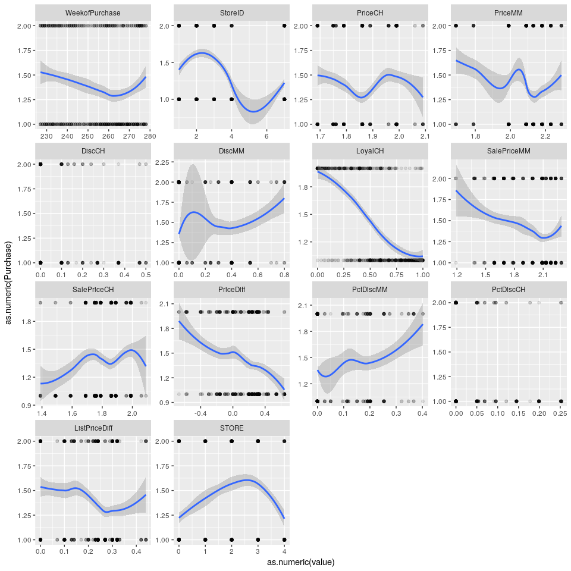
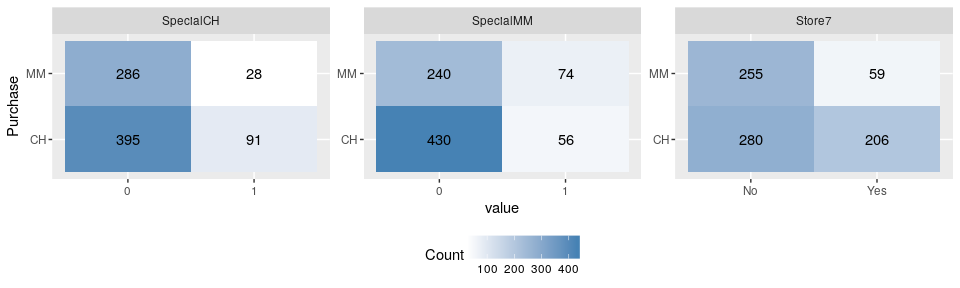
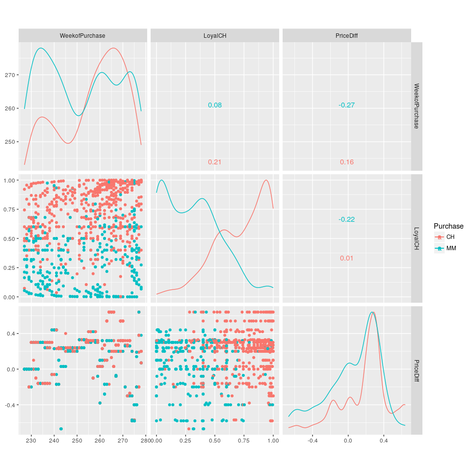

Classifying Orange Juice Brand Sales
================
Chase Baggett

Introduction
============

I will be using Support Vector Machines to model the purchasing decisions of two brands of orange juice. I will use linear, radial, and polynomial kernels to do this in order to identify the most accurate kernel for this dataset.

Data
====

I will be splitting my dataset into 800 training records, leaving the remaining 270 for prediction at the end of my cross validation in order to evaluate the techniques against each other.

``` r
set.seed(333)
tridx <- sample(x = 1:nrow(OJ),size = 800,replace = F)
train <- OJ[tridx,]
test <- OJ[-tridx,]
```

Analysis
========

Exploration
-----------

### Class Separation

I'm generating a facet plot to show separation of our two class via a smooth on our continuous predictors. Immediately its apparent that LoyalCH has a strong predictor or class balance, and PriceDiff appears to provide separation as well as

``` r
p_dat <- melt(train,id.vars = "Purchase")
p_dat <- subset(p_dat,!variable %in% c("SpecialMM",
                                      "SpecialCH",
                                      "Store7"))
ggplot(p_dat,aes(y=as.numeric(Purchase),x=as.numeric(value))) + 
  geom_point(alpha=.1) + 
  geom_smooth(method="loess") + 
  facet_wrap(~variable,scales = "free")
```



### Heat Maps of Categorical Variables

74 times people bought MM when MM was on special. 56 times, they bought CH when MM was on special. So when MM runs a special, 56% of the time people bought MM. This is compared to their normal 35% share of the market during non-specials (240/(240+430)).

91 times people bought CH when CH was on special. 28 times people bought MM when CH was on special. So when CH runs a special, 76% of the time people bought CH. This is compared to their normal 42% share of the market during non speicals (286/(286+395)).

At first glance, CH has more effective special pricing. Their market share surges 24% during a special, vs 21% for MM. It is apparent looking at this data that special pricing does seem to impact the probability of purchase.

In addition, Store7 seems to be more likely to sell CH, with significantly a lower likelihood of selling MM if it is this store. However, this data is also represented in the STORE variable, so its unclear why the data calls out this specific store.

``` r
p_dat <- melt(train,id.vars = "Purchase")
p_dat <- subset(p_dat,variable %in% c("SpecialMM",
                                      "SpecialCH",
                                      "Store7"))
p_dat <- summarise(group_by(p_dat,Purchase,variable,value),Count=n())
ggplot(p_dat,aes(y=Purchase,x=value,fill=Count)) + 
  geom_tile() + 
  scale_fill_gradient(low = "white", high = "steelblue") +
  geom_text(aes(label = round(Count, 1))) +
  facet_wrap(~variable,scales="free") +
  theme(legend.position="bottom")
```



### ScatterPlot Matrix

An interesting feature of our data is extreme aggregation on a few points. Despite having 800 records in our training data, only 3 variables have more than 20 unique values.

``` r
rapply(train,function(x)length(unique(x)))
```

    ##       Purchase WeekofPurchase        StoreID        PriceCH        PriceMM 
    ##              2             52              5             10              8 
    ##         DiscCH         DiscMM      SpecialCH      SpecialMM        LoyalCH 
    ##             12             12              2              2            438 
    ##    SalePriceMM    SalePriceCH      PriceDiff         Store7      PctDiscMM 
    ##             18             13             36              2             18 
    ##      PctDiscCH  ListPriceDiff          STORE 
    ##             13             18              5

I've taken those 3 variables and generated a scatterplot matrix.

I see what looks like pretty linear separatiopn between the two classes. It looks like LoyalCH + PriceDiff could create a pretty strong classifier with a linear line.

``` r
sm_plot <- train[,c("Purchase","WeekofPurchase","LoyalCH","PriceDiff")]
ggscatmat(sm_plot,color="Purchase")
```



Linear Kernel
-------------

First, we fit a linear kernel Support Vector Classifier to do 2 class prediction with a cost of .01. This will use a hyperplane that is linear in all of its dimensions.

``` r
fit.linear=svm(Purchase~., data=train, kernel="linear",cost=.01)
summary(fit.linear)
```

    ## 
    ## Call:
    ## svm(formula = Purchase ~ ., data = train, kernel = "linear", 
    ##     cost = 0.01)
    ## 
    ## 
    ## Parameters:
    ##    SVM-Type:  C-classification 
    ##  SVM-Kernel:  linear 
    ##        cost:  0.01 
    ##       gamma:  0.05555556 
    ## 
    ## Number of Support Vectors:  428
    ## 
    ##  ( 213 215 )
    ## 
    ## 
    ## Number of Classes:  2 
    ## 
    ## Levels: 
    ##  CH MM

### Initial Results

We end up with about 82% Balanced Accuracy on our training set and 79% Balanced Accuracy on the test set.

Balanced Accuracy is defined below.

$$ \\frac{\\frac{True Positives}{Positives} + \\frac{True Negatives}{Negatvies}}{2}$$
.

I am using it throughout as a measure of accuracy that takes into account both classes, given that there is some class imbalance in the dataset.

``` r
train_cm <- confusionMatrix(predict(fit.linear), train$Purchase)
test_cm <-confusionMatrix(predict(fit.linear, newdata = test), test$Purchase)
acc <- list()
acc[["Train_Accuracy"]] <- train_cm$byClass[["Balanced Accuracy"]][[1]]
acc[["Test_Accuracy"]] <- test_cm$byClass[["Balanced Accuracy"]]
formattable(as.data.frame(acc))
```

<table class="table table-condensed">
<thead>
<tr>
<th style="text-align:right;">
Train\_Accuracy
</th>
<th style="text-align:right;">
Test\_Accuracy
</th>
</tr>
</thead>
<tbody>
<tr>
<td style="text-align:right;">
0.8223965
</td>
<td style="text-align:right;">
0.7885007
</td>
</tr>
</tbody>
</table>
### Cross Validation

I'm going to create a grid of 25 different costs between .01 and 10 and test each of them, and search for the optimal cost within the training set. Then I will take the one winner from the training set and predict it on the test set.

``` r
set.seed(333)
possibilities <- seq(.01,10,.01)
costs <- sample(x=possibilities,size = 25)
tune(svm,Purchase~.,data=train,kernel="linear",ranges=list(cost=costs))
```

    ## 
    ## Parameter tuning of 'svm':
    ## 
    ## - sampling method: 10-fold cross validation 
    ## 
    ## - best parameters:
    ##  cost
    ##  6.57
    ## 
    ## - best performance: 0.16875

Now I am going to fit a new SVM with a cost of 6.57, and then generate new train and test accuracies. We see there is minimal improvement or change in the balanced accuracy of the model.

``` r
fit.cv=svm(Purchase~., data=train, kernel="linear",cost=6.57)
train_cm <- confusionMatrix(predict(fit.cv), train$Purchase)
test_cm <-confusionMatrix(predict(fit.cv, newdata = test), test$Purchase)
acc <- list()
acc[["Train_Accuracy"]] <- train_cm$byClass[["Balanced Accuracy"]][[1]]
acc[["Test_Accuracy"]] <- test_cm$byClass[["Balanced Accuracy"]]
formattable(as.data.frame(acc))
```

<table class="table table-condensed">
<thead>
<tr>
<th style="text-align:right;">
Train\_Accuracy
</th>
<th style="text-align:right;">
Test\_Accuracy
</th>
</tr>
</thead>
<tbody>
<tr>
<td style="text-align:right;">
0.82661
</td>
<td style="text-align:right;">
0.7885007
</td>
</tr>
</tbody>
</table>
Radial Kernel
-------------

Now I am going to try an SVM with a radial kernel. It is entirely possible the linear kernel separates our data, but if the linear kernel isn't cutting our data, the radial kernel will allow the svm to create non-linear separations in the hyperplane. If our separations are linear this will provide little value, but if they are not, we could see dramatic improvement.

### Initial Results

With our first cost, we get a slightly better training accuracy but a lower test accuracy. It makes sense that more flexibility in the kernel could lead to overfitting which seems to be what I'm seeing here.

``` r
fit.radial=svm(Purchase~., data=train, kernel="radial",cost=1)
train_cm <- confusionMatrix(predict(fit.radial), train$Purchase)
test_cm <-confusionMatrix(predict(fit.radial, newdata = test), test$Purchase)
acc <- list()
acc[["Train_Accuracy"]] <- train_cm$byClass[["Balanced Accuracy"]][[1]]
acc[["Test_Accuracy"]] <- test_cm$byClass[["Balanced Accuracy"]]
formattable(as.data.frame(acc))
```

<table class="table table-condensed">
<thead>
<tr>
<th style="text-align:right;">
Train\_Accuracy
</th>
<th style="text-align:right;">
Test\_Accuracy
</th>
</tr>
</thead>
<tbody>
<tr>
<td style="text-align:right;">
0.837632
</td>
<td style="text-align:right;">
0.7799256
</td>
</tr>
</tbody>
</table>
### Cross Validation

We will see if cross validation to find an optimal cost can improve the radial SVM performance.

``` r
set.seed(333)
tune(svm,Purchase~.,data=train,kernel="radial",ranges=list(cost=costs))
```

    ## 
    ## Parameter tuning of 'svm':
    ## 
    ## - sampling method: 10-fold cross validation 
    ## 
    ## - best parameters:
    ##  cost
    ##  0.85
    ## 
    ## - best performance: 0.15875

Now I refit with a cost of .85 and see little change. My belief at this point is that our problem is fundamentally linear.

``` r
fit.radial=svm(Purchase~., data=train, kernel="radial",cost=.85)
train_cm <- confusionMatrix(predict(fit.radial), train$Purchase)
test_cm <-confusionMatrix(predict(fit.radial, newdata = test), test$Purchase)
acc <- list()
acc[["Train_Accuracy"]] <- train_cm$byClass[["Balanced Accuracy"]][[1]]
acc[["Test_Accuracy"]] <- test_cm$byClass[["Balanced Accuracy"]]
formattable(as.data.frame(acc))
```

<table class="table table-condensed">
<thead>
<tr>
<th style="text-align:right;">
Train\_Accuracy
</th>
<th style="text-align:right;">
Test\_Accuracy
</th>
</tr>
</thead>
<tbody>
<tr>
<td style="text-align:right;">
0.8392244
</td>
<td style="text-align:right;">
0.7720772
</td>
</tr>
</tbody>
</table>
Polynomial Kernel
-----------------

I didn't see it in the exploration of the data. but I will give the polynomial kernel a chance. It is going to be more flexible than the radial kernel, so seems more likely to overfit, which is what it looks like happened, with higher train, but lower test accuracy.

### Initial Results

``` r
fit.poly=svm(Purchase~., data=train, kernel="polynomial",cost=1,degree=2)
train_cm <- confusionMatrix(predict(fit.poly), train$Purchase)
test_cm <-confusionMatrix(predict(fit.poly, newdata = test), test$Purchase)
acc <- list()
acc[["Train_Accuracy"]] <- train_cm$byClass[["Balanced Accuracy"]][[1]]
acc[["Test_Accuracy"]] <- test_cm$byClass[["Balanced Accuracy"]]
formattable(as.data.frame(acc))
```

<table class="table table-condensed">
<thead>
<tr>
<th style="text-align:right;">
Train\_Accuracy
</th>
<th style="text-align:right;">
Test\_Accuracy
</th>
</tr>
</thead>
<tbody>
<tr>
<td style="text-align:right;">
0.7944418
</td>
<td style="text-align:right;">
0.7258008
</td>
</tr>
</tbody>
</table>
### Cross Validation

Now I am going to use cross-validation to set the cost to see if a better cost might give me a more accurate model.

``` r
set.seed(333)
tune(svm,Purchase~.,data=train,kernel="polynomial",ranges=list(cost=costs))
```

    ## 
    ## Parameter tuning of 'svm':
    ## 
    ## - sampling method: 10-fold cross validation 
    ## 
    ## - best parameters:
    ##  cost
    ##  4.68
    ## 
    ## - best performance: 0.18125

However, the worst possible outcome has been achieved, where training accuracy is very high, but the test accuracy is very low.

``` r
fit.radial=svm(Purchase~., data=train, kernel="polynomial",cost=4.68)
train_cm <- confusionMatrix(predict(fit.radial), train$Purchase)
test_cm <-confusionMatrix(predict(fit.radial, newdata = test), test$Purchase)
acc <- list()
acc[["Train_Accuracy"]] <- train_cm$byClass[["Balanced Accuracy"]][[1]]
acc[["Test_Accuracy"]] <- test_cm$byClass[["Balanced Accuracy"]]
formattable(as.data.frame(acc))
```

<table class="table table-condensed">
<thead>
<tr>
<th style="text-align:right;">
Train\_Accuracy
</th>
<th style="text-align:right;">
Test\_Accuracy
</th>
</tr>
</thead>
<tbody>
<tr>
<td style="text-align:right;">
0.8364066
</td>
<td style="text-align:right;">
0.7440846
</td>
</tr>
</tbody>
</table>
Conclusion
==========

The linear SVM did very well. It makes sense, because in the scatterplots, I saw linear separation. The use of the radial and polynomial kernels increased training accuracy very marginally, but caused a drop in test set accuracy. It seems to me that the additional flexibility of these kernels allowed to model noise inside the dataset, resulting in overfitting that compromised the integrity of my test set predictions.
